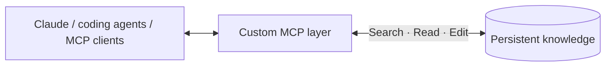
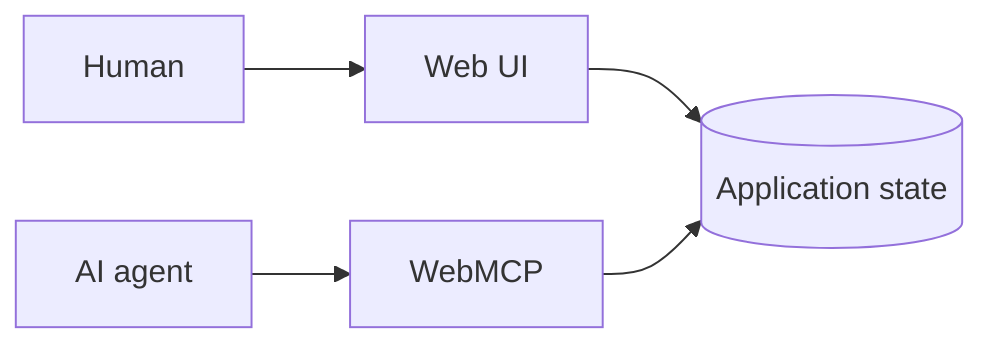
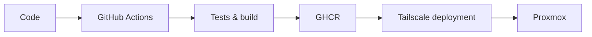
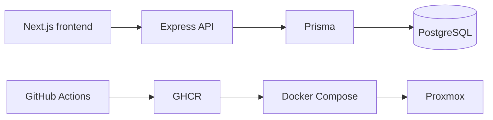

h1 align="center">Hi, I'm Javier Loro 👋</h1>

  <b>Software Engineer — AI integrations, full-stack applications & self-hosted systems</b>

  I build and operate applications, and design integrations that let AI agents work with persistent knowledge, 
  real software and automated workflows.

---

<h2 align="center">🧩 About me</h2>

  I enjoy building the whole thing: the application, the integrations around it, and the systems that keep it running. 
  My self-hosted environment is where I deploy many of my projects and explore how software and AI agents can work together.

<table align="center">
  <tr>
    <th align="center" width="33%">🌐 Applications</th>
    <th align="center" width="34%">🧠 AI integrations</th>
    <th align="center" width="33%">🏠 Self-hosted systems</th>
  </tr>
  <tr>
    <td align="center">Full-stack software from UI to persistence</td>
    <td align="center">MCP & WebMCP interfaces between agents, knowledge and applications</td>
    <td align="center">Deployment, networking, updates, monitoring and backups</td>
  </tr>
</table>

---

<h2 align="center">🚀 Selected projects</h2>

<h3>🧠 <a href="https://github.com/JavierLoro/Alexandrie">Alexandrie — Persistent knowledge through MCP</a></h3>

<b>A persistent knowledge layer shared across my AI environments.</b>

  
  
  
  
  

  I use Alexandrie as my self-hosted knowledge base and built an <b>MCP layer on top of it</b> 
  so Claude, coding agents and other MCP-compatible clients can access the same persistent information 
  across environments and conversations.

Engineering details · persistent knowledge and MCP

I extended an existing self-hosted application with an MCP server that exposes its
knowledge model through semantic operations.

- Designed tools for navigating, searching, reading and modifying documents.
- Added outline and section-level reads so agents do not need full documents for every task.
- Reduced unnecessary tool-response content to keep agent context focused.
- Added Streamable HTTP access for remote MCP clients.
- Integrated authentication and token handling for remote access.
- Kept the MCP rendering pipeline synchronized with the main application's Markdown renderer.
- Added agent-oriented operations without making the normal web application depend on MCP.
- Deployed and operate the integration on my own infrastructure.

The important part for me was not adding a chat interface to a wiki. It was turning
persistent knowledge into a reusable capability that different agents and environments
can access through a common interface.

---

<h3>🌐 <a href="https://github.com/JavierLoro/wiki-agent-webmcp">Workspace Platform — Learning WebMCP</a></h3>

<b>Exploring how web applications can expose their capabilities directly to AI agents.</b>

  
  
  
  
  
  

  Built as a practical environment for learning <b>WebMCP</b>: instead of having an agent navigate 
  the interface visually, the application exposes semantic operations over its own domain.

Engineering details · WebMCP and agent-facing application design

The project helped me explore what changes when an application is intentionally designed
to be usable by both humans and agents.

**What I explored**

- Designing semantic domain operations instead of UI automation.
- Deciding which application capabilities should be exposed to an agent and which should remain internal.
- Returning focused context instead of leaking the whole application state into every interaction.
- Separating agent proposals from authoritative human decisions.
- Sharing persistent application state between humans and external agents.
- Keeping the regular web application fully usable when WebMCP is unavailable.
- Treating repository and user-provided content as data rather than instructions.
- Applying explicit limits to repository exploration, model calls, bytes, tokens and estimated cost.

**Implemented capabilities**

- Inspect workspace context, tasks, children, open items and activity.
- Create or update tasks and add structured knowledge.
- Propose decisions without making them authoritative automatically.
- Analyze public repositories and build evidence-backed import previews.
- Persist state in SQLite so application context survives individual AI conversations.

**Stack:** React, TypeScript, Node.js, Express, SQLite, Docker, OpenAI integrations and WebMCP.

---

<h3>🚀 <a href="https://github.com/JavierLoro/esigglol">ESIgg.lol</a></h3>

<b>A self-hosted web application I deploy, monitor and maintain end-to-end.</b>

  
  
  
  
  
  
  

  A production application where the interesting engineering extends beyond features: 
  automated testing, container delivery, private-network deployment, observability, backups and recovery.

<i>Used to manage internal League of Legends tournaments at ESI-UCLM.</i>

Engineering details · operating a real application

- **Application:** Next.js and TypeScript, SQLite with WAL mode, authentication and role-specific access.
- **External integrations:** Riot and Twitch APIs.
- **Validation & reliability:** Zod validation, Pino logging, health endpoints and Prometheus-compatible metrics.
- **Testing:** Unit and end-to-end tests with Vitest and Playwright.
- **Delivery:** GitHub Actions runs linting, tests and a production build, then publishes the Docker image to GHCR.
- **Private deployment:** GitHub Actions can reach the self-hosted environment through Tailscale and call an authenticated redeployment service.
- **Updates:** Docker Compose and Watchtower support production updates on the host.
- **Data protection:** Automated SQLite backups with snapshot validation and retention.

This project helped me move from **"the application works"** to **"the application can be deployed, updated, observed, backed up and recovered."**

---

<h3>🏗️ <a href="https://github.com/JavierLoro/webLogrosApp">webLogrosApp</a></h3>

<b>Building the complete full-stack application and delivery chain.</b>

  
  
  
  
  
  
  

  A progressive end-to-end project where I built and connected each layer myself: 
  frontend, backend, authentication, database, containers, reverse proxying, CI/CD and production deployment.

Engineering details · building the complete software delivery chain

- **Frontend:** Next.js + TypeScript + Tailwind CSS.
- **Backend:** Express + TypeScript.
- **Data:** Prisma ORM and PostgreSQL.
- **Authentication:** JWT-based authentication with bcrypt.
- **Architecture:** Multi-tenant application model with separate frontend, backend and persistence layers.
- **Containerization:** Docker images for frontend and backend plus Docker Compose for local and production environments.
- **Reverse proxying:** Nginx inside the application stack, with external routing handled by my self-hosted infrastructure.
- **CI/CD:** GitHub Actions builds and publishes images to GHCR.
- **Operations:** Proxmox deployment, environment configuration, secrets management and automated updates with Watchtower.

Rather than focusing on one unusual technical problem, this project represents the
experience of building and connecting the **whole application lifecycle** myself.

---

<h2 align="center">🛠️ Other public work</h2>

| Project | What it demonstrates |
|:---|:---|
| 🗺️ **[mc-chunk-map](https://github.com/JavierLoro/VanillaOnlineMapMC)** | Direct integration with binary world data, caching, performance optimization and self-hosted deployment. |
| 🧩 **[Bridges](https://bridgeshashi.jlc-dev.me)** | A small production web product delivered as a fast public service. |
| 📚 **[@vibliofriki_bot](https://t.me/vibliofriki_bot)** | Automation around an external API with configurable Telegram alerts. |

Systems work · binary formats, caching and performance

For **mc-chunk-map**, I implemented a custom Anvil/NBT parser that reads Minecraft
world files directly, then built an interactive map with FastAPI and Leaflet.

The work includes:

- direct read-only access to live `.mca` world files,
- custom binary/NBT parsing,
- incremental processing and a persistent chunk cache,
- server-rendered PNG map layers,
- compressed tile metadata,
- progressive loading,
- Docker/systemd deployment,
- cross-container access on Proxmox.

Replacing large raw-data transfers with rendered layers and compressed metadata reduced
initial map loading from tens of seconds to around one second **in my environment**.

---

<h2 align="center">🏠 Behind the projects</h2>

  <b>Self-hosted applications · Proxmox VE · Docker · private networking</b> 
  I manage the deployment, connectivity, updates, persistence and backups behind many of my projects. 
  I also use coding agents with explicit scopes and independent checks of their work.

Infrastructure · hosting, networking, updates and backups

My personal **Proxmox VE** environment runs applications, databases, reverse proxying,
internal DNS, private networking and other self-hosted services.

My delivery workflows use GitHub Actions, Docker and GHCR, with Tailscale for private
connectivity and Nginx or Cloudflare where appropriate. Individual projects use different
deployment arrangements depending on their needs.

Running this environment gives me hands-on experience with:

- networking and service exposure,
- authentication,
- persistent storage,
- deployment and upgrades,
- health checks and monitoring,
- backups and recovery,
- reverse proxies and private connectivity.

AI-assisted development · workflow and private exploration

I use coding agents extensively, with a focus on making their work bounded and verifiable:

- Bounded context and explicit task scopes.
- Structured handoffs and persistent project state.
- Independent verification instead of trusting an agent's completion message.
- Evidence-based completion through tests, checks and structured results.

**Codex Projects Replica — private, ongoing**

A personal engineering project exploring persistent project coordination for coding agents:
bounded context, coordinator/orchestrator separation, independent verification, project
memory and evidence-based task completion.

The goal is not simply to run more agents, but to explore how agent-assisted development
can remain understandable, reproducible and verifiable across long-running projects.

Full technology stack

| Area | Technologies |
|---|---|
| Languages | TypeScript · JavaScript · Python · Go · C# · Kotlin · C++ |
| Frontend | React · Next.js · Vue · Tailwind CSS |
| Backend | Node.js · Express · FastAPI · Go |
| Data | PostgreSQL · SQLite · Prisma |
| AI integration | MCP · WebMCP · agent-facing tools · persistent agent context |
| Infrastructure | Docker · Docker Compose · Proxmox · Nginx · Cloudflare · Tailscale |
| Delivery | GitHub Actions · GHCR · automated deployments |
| Operations | Linux · health checks · metrics · backups · reverse proxies |

---

<picture>
  <source media="(prefers-color-scheme: dark)" srcset="https://raw.githubusercontent.com/JavierLoro/JavierLoro/output/github-contribution-grid-snake-dark.svg">
  <source media="(prefers-color-scheme: light)" srcset="https://raw.githubusercontent.com/JavierLoro/JavierLoro/output/github-contribution-grid-snake.svg">
  
</picture>

